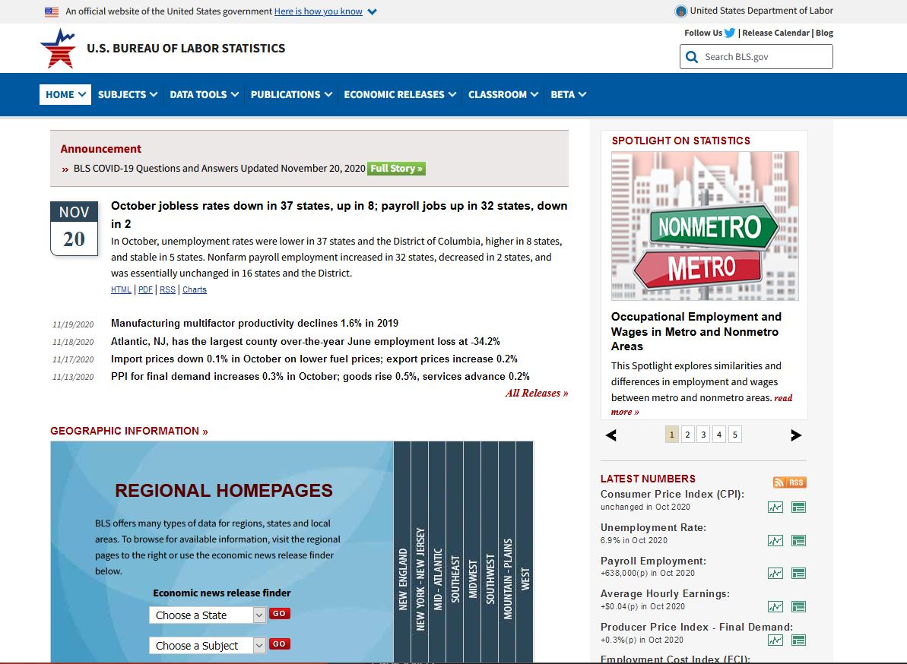
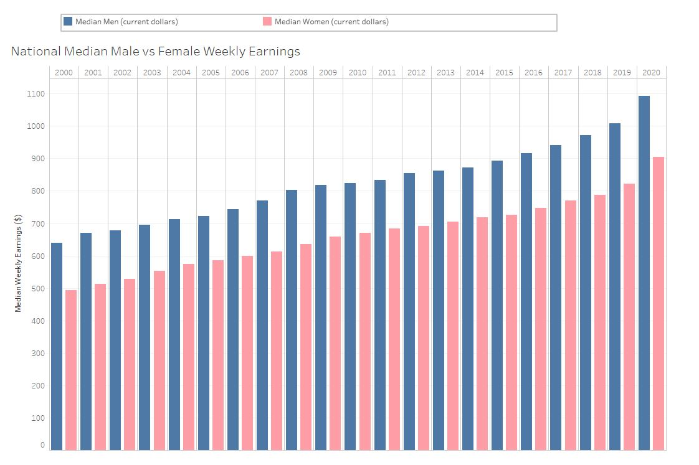
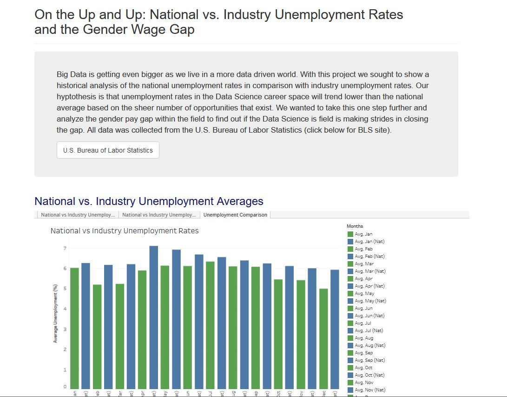

# OnTheUpAndUp

## Project Purpose
Analyze historical unemployment and salary data on a national level and compare the data to the same data values within the Data Science field.  Analysis is taken a step further when unemployment and compensation are analyzed and broken down by gender.

## Process

### Data Collection
All data was collected from BLS.gov and cleaned in combination using Pandas and Excel

<!-- ### Data Wrangling and Tableau -->

### Making Connections and Finding Trends

## Results

Screenshot of the interactive landing page

